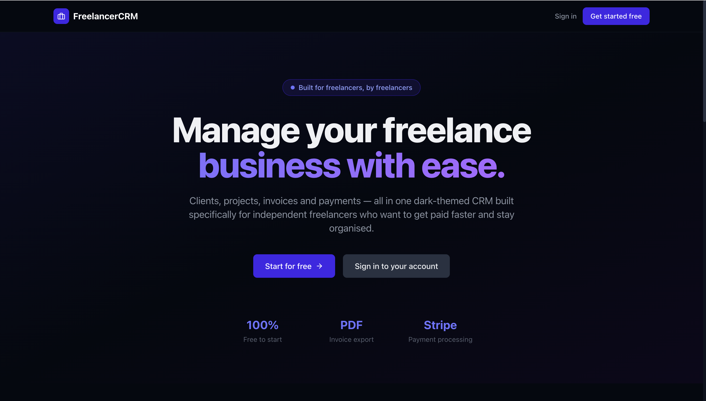
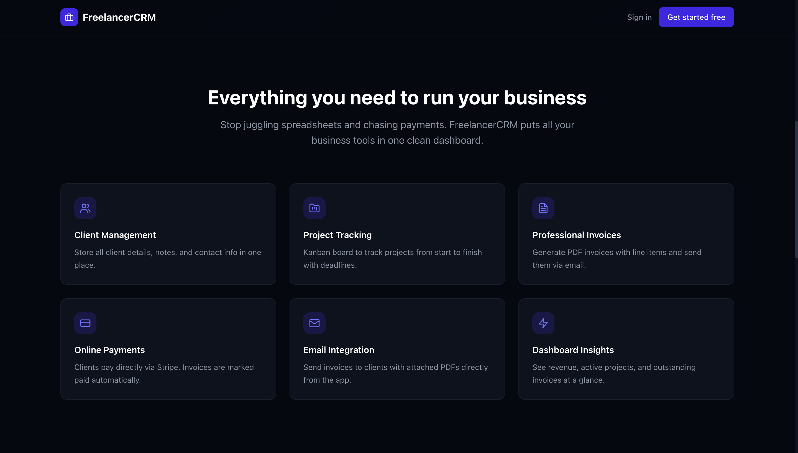
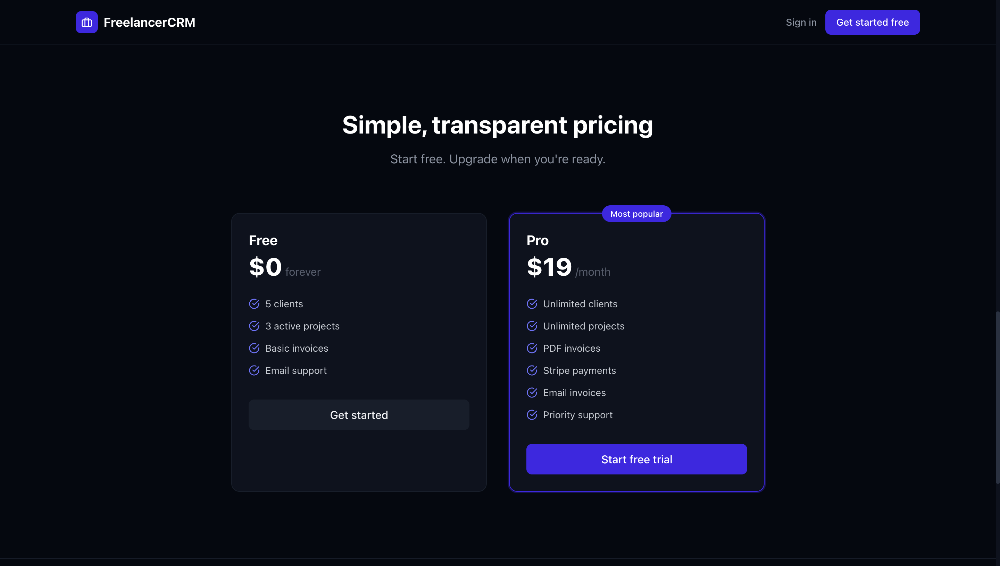
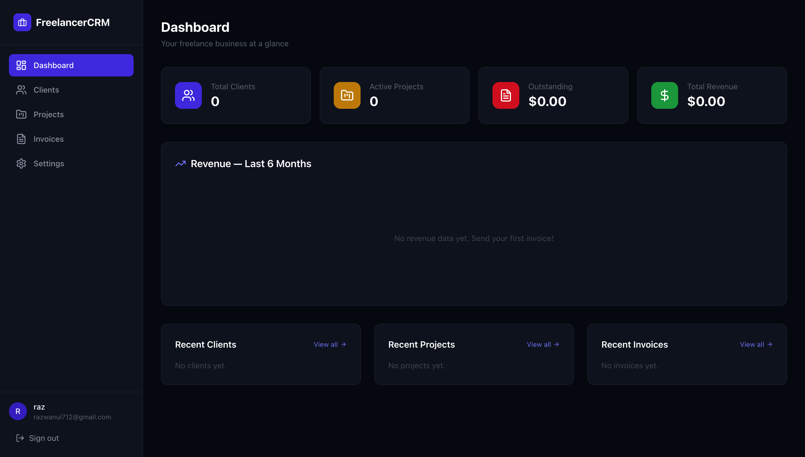
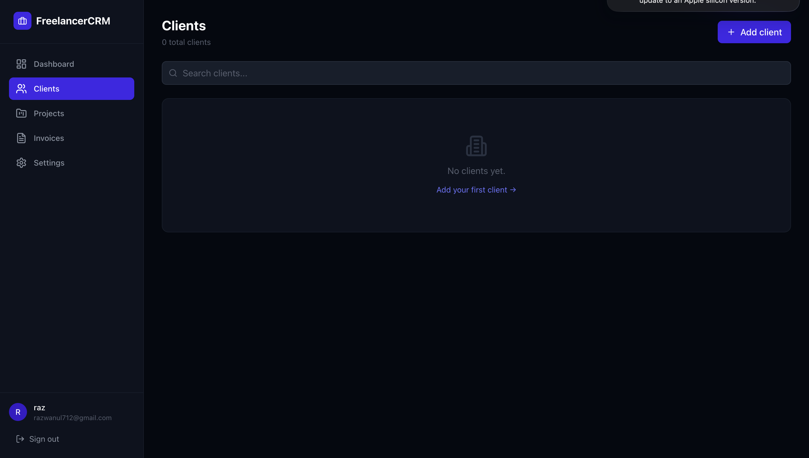
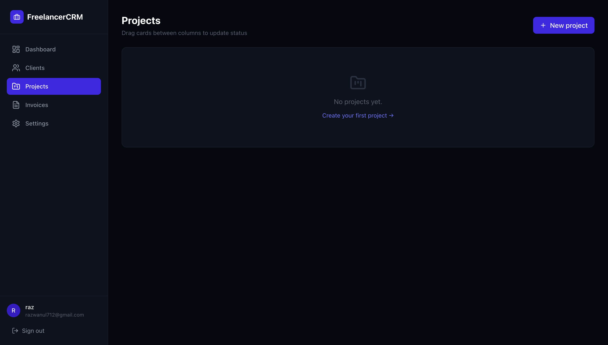
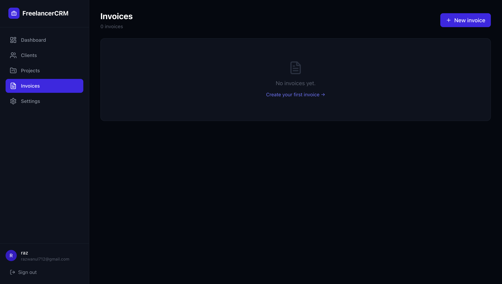

# FreelancerCRM

A full-stack SaaS CRM built for freelancers to manage clients, projects, invoices, and payments — all in one place.


---

## Live Demo

- **Frontend:** https://freelancer-crm1.netlify.app
- **Backend API:** https://freelancer-crm-backend-zxd4.onrender.com

---

## Screenshots

### Landing Page




### App





---

## Features

### Authentication
- Register with email + password (min 8 characters)
- Email verification required before login
- JWT access tokens (15 min expiry) with silent refresh via httpOnly refresh cookie (7 days)
- Update profile name/email and change password from Settings

### Clients
- Create, edit, and delete clients
- Store name, email, phone, company, and notes per client
- Inline confirm/cancel delete (no browser dialogs)

### Projects
- Create, edit, and delete projects
- Link each project to a client
- Kanban board with drag-and-drop columns: Not Started / In Progress / Completed
- Store rate (hourly or fixed), deadline, and description

### Invoices
- Create invoices with multiple line items (description, quantity, unit price)
- Auto-generated invoice numbers in `INV-YYYYMM-XXXX` format
- Statuses: Draft → Sent → Paid / Overdue
- Download invoice as a professionally styled PDF
- Send invoice directly to client via email with PDF attached
- Pay via Stripe Checkout — invoice marked as paid automatically via webhook

### Dashboard
- Summary stats: total clients, active projects, outstanding invoices, total revenue
- Revenue bar chart for the last 6 months
- Recent activity tables for clients, projects, and invoices

### Settings
- Update profile (name + email)
- Change password

---

## Tech Stack

| Layer | Technology |
|---|---|
| Frontend | React 18, TypeScript, Vite |
| Styling | Tailwind CSS v3, custom utility classes |
| Charts | Recharts |
| Drag & Drop | dnd-kit |
| Icons | Lucide React |
| HTTP Client | Axios with automatic refresh token interceptor |
| Backend | Node.js, Express |
| Database | PostgreSQL via Supabase (Transaction Pooler) |
| Auth | JWT (access) + httpOnly refresh cookie |
| Payments | Stripe Checkout + Webhooks |
| Email | Resend with PDF attachment |
| PDF | PDFKit |
| Hosting | Netlify (frontend), Render (backend) |

---

## Architecture

```
┌─────────────────────────────────────┐
│         Netlify (Frontend)          │
│   React + TypeScript + Tailwind     │
│   Vite build → /dist                │
│   Axios → VITE_API_URL              │
└───────────────┬─────────────────────┘
                │ HTTPS REST API
                ▼
┌─────────────────────────────────────┐
│          Render (Backend)           │
│   Node.js + Express                 │
│   JWT auth middleware               │
│   Routes: auth, clients, projects,  │
│           invoices, billing,        │
│           dashboard                 │
└──────┬──────────────┬───────────────┘
       │              │
       ▼              ▼
┌──────────┐   ┌──────────────────────┐
│ Supabase │   │  Third-party Services│
│PostgreSQL│   │  - Stripe (payments) │
│ port 6543│   │  - Resend (email)    │
└──────────┘   └──────────────────────┘
```

**Request flow:**
1. Browser makes API call with `Authorization: Bearer <accessToken>` header
2. Express `requireAuth` middleware verifies JWT and attaches `userId` to request
3. Route handler queries PostgreSQL, always scoped to `req.userId`
4. On 401 response, Axios interceptor silently calls `/auth/refresh` using the httpOnly cookie, then retries the original request

---

## Project Structure

```
freelancer-crm/
├── backend/
│   ├── index.js                  # Express entry point — middleware order matters
│   ├── package.json
│   ├── .env.example
│   └── src/
│       ├── db.js                 # PostgreSQL pool + schema init
│       ├── email.js              # Resend email helpers
│       ├── pdf.js                # PDFKit invoice generator
│       ├── middleware/
│       │   └── auth.js           # requireAuth — verifies JWT, attaches req.userId
│       └── routes/
│           ├── auth.js           # Register, login, refresh, logout, verify email, profile
│           ├── clients.js        # CRUD clients
│           ├── projects.js       # CRUD projects
│           ├── invoices.js       # CRUD invoices + PDF download + email send
│           ├── billing.js        # Stripe checkout + webhook
│           └── dashboard.js      # Aggregated stats + recent activity
└── frontend/
    ├── index.html
    ├── package.json
    ├── vite.config.ts
    ├── tailwind.config.js
    ├── public/
    │   └── _redirects            # Netlify SPA routing fix
    └── src/
        ├── App.tsx               # Router + protected routes
        ├── apiClient.ts          # Axios instance + refresh interceptor
        ├── main.tsx
        ├── index.css             # Tailwind + shared component classes
        ├── contexts/
        │   └── AuthContext.tsx   # Global auth state
        ├── components/
        │   ├── Layout.tsx        # Wraps all protected pages
        │   ├── Sidebar.tsx       # Desktop sidebar + mobile drawer
        │   ├── Modal.tsx         # Reusable modal wrapper
        │   ├── ProtectedRoute.tsx
        │   └── StatusBadge.tsx
        ├── pages/
        │   ├── Landing.tsx
        │   ├── Login.tsx
        │   ├── Register.tsx
        │   ├── Dashboard.tsx
        │   ├── Clients.tsx
        │   ├── Projects.tsx      # Kanban drag-and-drop board
        │   ├── Invoices.tsx
        │   ├── InvoiceDetail.tsx
        │   └── Settings.tsx
        └── types/
            └── index.ts          # All shared TypeScript interfaces
```

---

## Database Schema

```sql
users (
  id TEXT PRIMARY KEY,
  name TEXT NOT NULL,
  email TEXT UNIQUE NOT NULL,
  password_hash TEXT NOT NULL,
  created_at TEXT NOT NULL,
  email_verified BOOLEAN NOT NULL DEFAULT false,
  verification_token TEXT
)

refresh_tokens (
  id TEXT PRIMARY KEY,
  token TEXT UNIQUE NOT NULL,
  user_id TEXT REFERENCES users(id) ON DELETE CASCADE,
  expires_at TEXT NOT NULL,
  created_at TEXT NOT NULL
)

clients (
  id TEXT PRIMARY KEY,
  user_id TEXT REFERENCES users(id) ON DELETE CASCADE,
  name TEXT NOT NULL,
  email TEXT,
  phone TEXT,
  company TEXT,
  notes TEXT,
  created_at TEXT NOT NULL
)

projects (
  id TEXT PRIMARY KEY,
  user_id TEXT REFERENCES users(id) ON DELETE CASCADE,
  client_id TEXT REFERENCES clients(id) ON DELETE SET NULL,
  title TEXT NOT NULL,
  description TEXT,
  status TEXT NOT NULL DEFAULT 'not_started',
  rate NUMERIC,
  rate_type TEXT,
  deadline TEXT,
  created_at TEXT NOT NULL
)

invoices (
  id TEXT PRIMARY KEY,
  user_id TEXT REFERENCES users(id) ON DELETE CASCADE,
  client_id TEXT REFERENCES clients(id) ON DELETE SET NULL,
  project_id TEXT REFERENCES projects(id) ON DELETE SET NULL,
  invoice_number TEXT NOT NULL,
  status TEXT NOT NULL DEFAULT 'draft',
  due_date TEXT,
  total NUMERIC NOT NULL DEFAULT 0,
  created_at TEXT NOT NULL
)

invoice_items (
  id TEXT PRIMARY KEY,
  invoice_id TEXT REFERENCES invoices(id) ON DELETE CASCADE,
  description TEXT NOT NULL,
  quantity NUMERIC NOT NULL DEFAULT 1,
  unit_price NUMERIC NOT NULL DEFAULT 0
)

payments (
  id TEXT PRIMARY KEY,
  invoice_id TEXT REFERENCES invoices(id) ON DELETE CASCADE,
  amount NUMERIC NOT NULL,
  stripe_session_id TEXT,
  paid_at TEXT NOT NULL
)
```

---

## Quick Start

### Prerequisites

- Node.js 18+
- A [Supabase](https://supabase.com) project (free tier works)
- A [Stripe](https://stripe.com) account (test mode)
- A [Resend](https://resend.com) account (free tier works)

### 1. Clone the repo

```bash
git clone https://github.com/rchowdhury-1/freelancer-crm.git
cd freelancer-crm
```

### 2. Install dependencies

```bash
cd backend && npm install
cd ../frontend && npm install
```

### 3. Configure environment variables

```bash
cp backend/.env.example backend/.env
cp frontend/.env.example frontend/.env
```

Fill in both `.env` files — see the Environment Variables section below.

### 4. Run locally

```bash
# Terminal 1 — backend
cd backend && npm run dev

# Terminal 2 — frontend
cd frontend && npm run dev
```

---

## Environment Variables

### Backend (`backend/.env`)

| Variable | Description |
|---|---|
| `PORT` | Port to run the server on (default: 5000) |
| `NODE_ENV` | `development` or `production` |
| `DATABASE_URL` | Supabase Transaction Pooler URL — use port **6543** |
| `JWT_SECRET` | Secret for signing access tokens — generate with `node -e "console.log(require('crypto').randomBytes(64).toString('hex'))"` |
| `REFRESH_SECRET` | Secret for signing refresh tokens — generate separately from JWT_SECRET |
| `STRIPE_SECRET_KEY` | Stripe secret key — starts with `sk_test_` or `sk_live_` |
| `STRIPE_WEBHOOK_SECRET` | Stripe webhook signing secret — starts with `whsec_` |
| `RESEND_API_KEY` | Resend API key — starts with `re_` |
| `EMAIL_FROM` | Sender address — use `onboarding@resend.dev` for testing |
| `BACKEND_URL` | Full backend URL — no trailing slash |
| `CLIENT_URL` | Full frontend URL — no trailing slash (used for CORS and redirect URLs) |

### Frontend (`frontend/.env`)

| Variable | Description |
|---|---|
| `VITE_API_URL` | Backend URL — no trailing slash |

---

## Deployment

### Backend → Render

1. Go to [render.com](https://render.com) → **New → Web Service**
2. Connect your GitHub repo
3. Set:
   - **Root Directory:** `backend`
   - **Build Command:** `npm install`
   - **Start Command:** `node index.js`
4. Add all backend environment variables
5. Deploy and note your Render URL

> Use the Supabase **Transaction Pooler** URL (port 6543) — Render free tier is IPv4-only.

### Frontend → Netlify

1. Go to [netlify.com](https://netlify.com) → **Add new site → Import from Git**
2. Set:
   - **Base directory:** `frontend`
   - **Build command:** `npm run build`
   - **Publish directory:** `dist`
3. Add env var: `VITE_API_URL=https://<your-render-url>`
4. Deploy, then trigger a redeploy to bake the env var into the build

### Stripe Webhook

1. Stripe Dashboard → **Developers → Webhooks → Add endpoint**
2. URL: `https://<your-render-url>/billing/webhook`
3. Event: `checkout.session.completed`
4. Copy the `whsec_...` secret → add to Render as `STRIPE_WEBHOOK_SECRET`

---

## License

MIT
